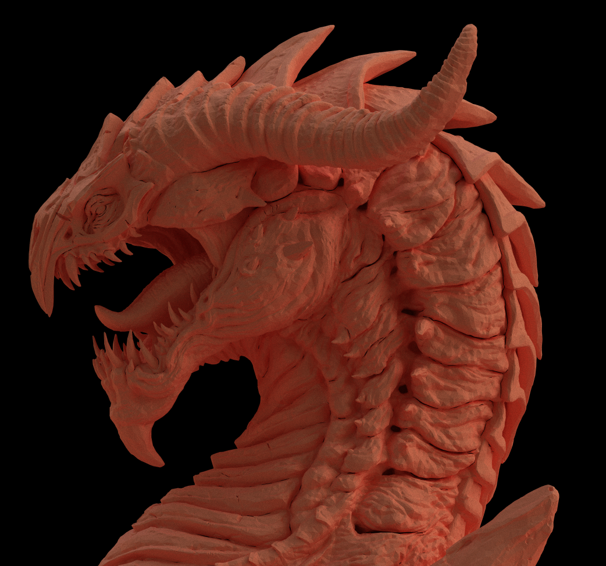

# OpenGL PathTracer

Achievements :
- [x] Compute shaders
- [x] Camera controls
- [x] Accumulation
- [x] Glossy and specular reflections 
- [x] OBJ imports
- [x] Acceleration structures, BVH (Bounding Volume hierarchy for every object)
- [x] Smooth shading
- [X] CubeMap skybox
- [x] Scenes preset import with ImGUI
- [x] Gamma correction and Tone mapping

Remaining :
- Optimise the cutting process : heuristic instead of average centroid position