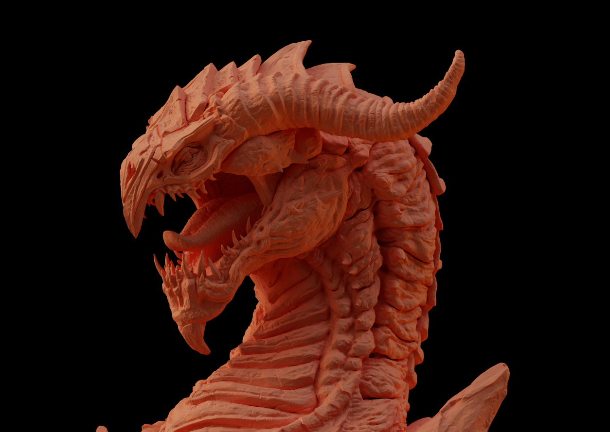

# glPathTracer

**glPathTracer** is a personal real-time path tracing renderer built with OpenGL 4.5 compute shaders. This project plays the role of introducing custom BRDFs and complex buffer management. 



## Features

- **Compute Shaders**: Utilizes OpenGL 4.5 compute shaders for parallel processing of rendering tasks.
- **Camera Controls**: Interactive camera movement and positioning.
- **Accumulation**: Reduces noise through frame accumulation over time.
- **Glossy and Specular Reflections**: Simulates realistic surface reflections.
- **OBJ Imports**: Supports importing 3D models in OBJ format.
- **Acceleration Structures**: Implements Bounding Volume Hierarchy (BVH) for faster rendering.
- **Smooth Shading**: Produces smooth lighting transitions on surfaces.
- **CubeMap Skybox**: Incorporates environmental backgrounds.
- **Scene Preset Imports**: Uses ImGUI for loading and managing scene presets.
- **Gamma Correction and Tone Mapping**: Ensures accurate color representation and dynamic range.

## Remaining features to implement

- **Optimization**: Enhance the BVH cutting process using heuristic methods instead of average centroid position.
- **Textures**: Integrate textures in the rendering process. Simple colors for now.

## Installation

### Prerequisites

Ensure you have the following tools and libraries:

- CMake 3.28 or higher
- A C++17 compatible compiler
- OpenGL 4.5 compatible GPU
- GLFW, GLAD, ImGui, stb, and TinyOBJLoader libraries (included in `libs` directory)

### Build Instructions

1. Clone the repository:
```bash
   git clone https://github.com/yourusername/glPathTracer.git
   cd glPathTracer
```

2. Build the project using CMake:
```bash
mkdir build
cd build
cmake ..
cmake --build .
```

## Usage
- Run the compiled executable from the build directory.
- Use the mouse and keyboard to navigate the scene and control the camera.
- Load different scene presets using the ImGUI interface.

## License
This project is licensed under the CC-BY-NC-ND-4.0 License. See the LICENSE file for more details.
