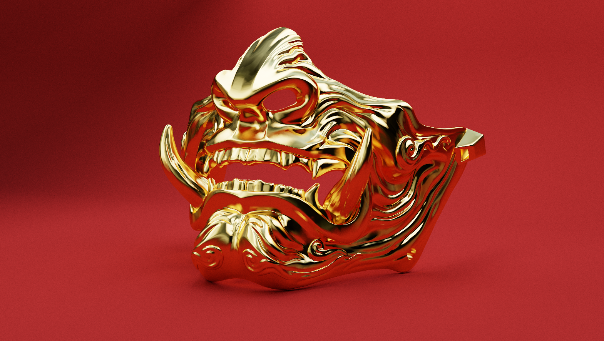

# glPathTracer

**glPathTracer** is a personal real-time path tracing renderer built with OpenGL 4.5 compute shaders. This project plays the role of introducing custom BRDFs and complex buffer management. 




## Features

- **Compute Shaders**: Utilizes OpenGL 4.5 compute shaders for parallel processing of rendering tasks.
- **Camera Controls**: Interactive camera movement and positioning.
- **Accumulation**: Reduces noise through frame accumulation over time.
- **Glossy and Specular Reflections**: Simulates realistic surface reflections.
- **OBJ Imports**: Supports importing 3D models in OBJ format.
- **Acceleration Structures**: Implements Bounding Volume Hierarchy (BVH) for faster rendering.
- **Smooth Shading**: Produces smooth lighting transitions on surfaces.
- **CubeMap Skybox**: Incorporates environmental backgrounds.
- **Scene Preset Imports**: Uses ImGUI for loading and managing scene presets.
- **Gamma Correction and Tone Mapping**: Ensures accurate color representation and dynamic range.

## Remaining features to implement

- **Optimization**: Enhance the BVH cutting process using heuristic methods instead of average centroid position.
- **Textures**: Integrate textures in the rendering process. Simple colors for now.

## Installation

### Prerequisites

Ensure you have the following tools and libraries:

- CMake 3.20 or higher
- A C++17 compatible compiler
- OpenGL 4.5 compatible GPU
- GLFW, GLAD, ImGui, stb, and TinyOBJLoader libraries (included in `libs` directory)

### Build Instructions

1. Clone the repository:
```bash
git clone https://github.com/yourusername/glPathTracer.git
cd glPathTracer
```

2. Build the project using CMake:
```bash
cmake -S . -B build
cmake --build build
```

## Usage
- Run the compiled executable in the build directory.
- Hold the right mouse button to activate focus mode. Use the keyboard to navigate the scene and the mouse to control the camera.
- Load different scene presets using the ImGUI interface.

## License
This project is licensed under the CC-BY-NC-ND-4.0 License. See the LICENSE file for more details.

## Useful resources if you want to build a similar project : 
- https://learnopengl.com/Guest-Articles/2022/Compute-Shaders/Introduction
- https://antongerdelan.net/opengl/compute.html
- https://www.youtube.com/watch?v=nF4X9BIUzx0
- https://raytracing.github.io/
- https://blog.demofox.org/2020/06/06/casual-shadertoy-path-tracing-2-image-improvement-and-glossy-reflections/
- https://github.com/RobertBeckebans/OpenGL-PathTracer
- https://www.scratchapixel.com/lessons/3d-basic-rendering/introduction-acceleration-structure/introduction.html
- https://jacco.ompf2.com/2022/04/13/how-to-build-a-bvh-part-1-basics/
- https://www.youtube.com/watch?v=C1H4zIiCOaI

Models are not mine, the links to their download pages :
- Dragon : https://sketchfab.com/3d-models/screaming-dragon-head-3d-print-5712b52618f743b193bdd39459099f25
- Mask : https://sketchfab.com/3d-models/samurai-mask-model-2-70a43b389819494f9fa23065ede03afc
