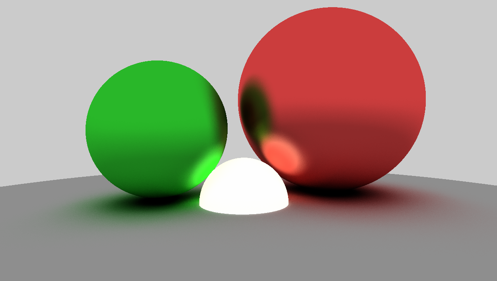

# OpenGL PathTracer

TODO : 

- [x] Camera controls
- [x] Multiple rays per pixel
- [x] Material glossy effect
- [ ] Triangles 1/2 (stored in compute shader only)
- [ ] ImGUI 1/2
- [ ] Proper skybox
- [ ] Scenes presets
- [ ] Clean and comment compute shader (ie : u_ before uniforms)